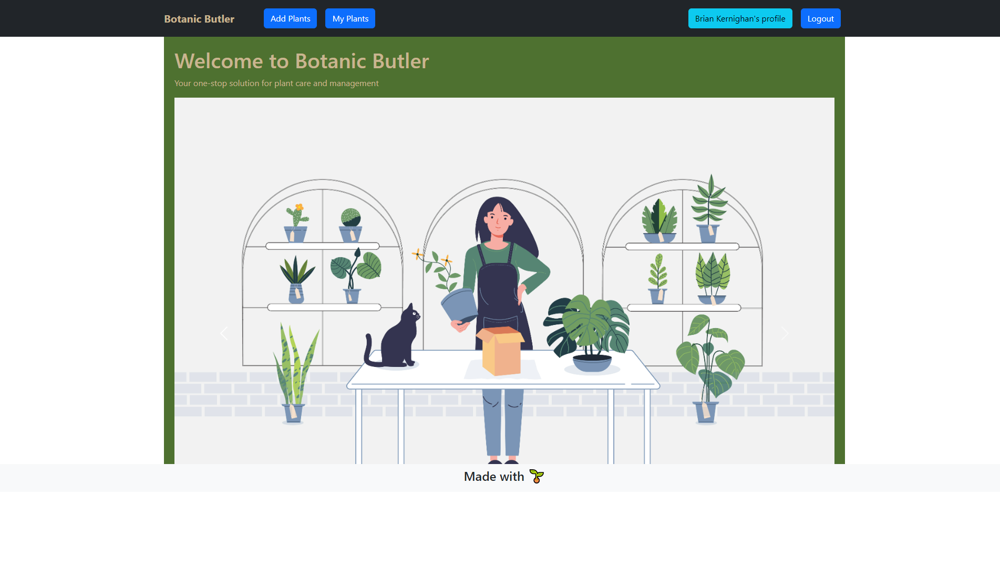
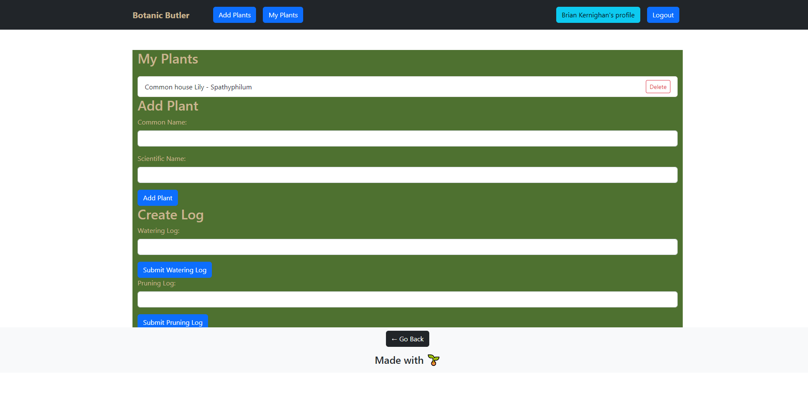

# Botanic Butler

Botanic Butler is a web application that helps you manage and track information about your plants. With Botanic Butler, you can easily add, view, and log activities for your plants, such as watering, pruning, and fertilizing.

## Features

- **My Plants:** View a list of your plants, including their common names and scientific names. You can also delete plants from the list.
- **Add Plant:** Add a new plant to your collection by providing its common name and scientific name.
- **Log Activities:** Create logs for various plant activities, such as watering, pruning, and fertilizing. Each log allows you to enter a log message.
- **User Authentication:** Sign up and log in to your account to access personalized features, such as viewing your profile and managing your plants.

## Screenshots

*My Plants page displaying a list of plants.*

*Add Plant page for adding a new plant to the collection.*
## Technologies Used

- [React](https://reactjs.org/): JavaScript library for building user interfaces
- [React Router](https://reactrouter.com/): Routing library for React applications
- [React Bootstrap](https://react-bootstrap.github.io/): UI library for React applications based on Bootstrap
- [Local Storage](https://developer.mozilla.org/en-US/docs/Web/API/Window/localStorage): Web API for storing data in the browser's local storage
- [Axios](https://axios-http.com/): HTTP client for making API requests
- [JWT](https://jwt.io/): JSON Web Tokens for user authentication and authorization

## Installation

1. Clone the repository: `git clone https://github.com/your-username/botanic-butler.git`
2. Navigate to the project directory: `cd botanic-butler`
3. Install the dependencies: `npm install`
4. Start the development server: `npm run develop`
5. Open your browser and visit: `http://localhost:3000`

## Usage

- Sign up for a new account or log in with your existing credentials.
- Use the navigation menu to navigate between different pages: Home, My Plants, Add Plant.
- On the My Plants page, view your plant collection and delete plants if needed.

## Contributing

Contributions are welcome! If you have any suggestions, bug reports, or feature requests, please open an issue on the [GitHub repository](https://github.com/your-username/botanic-butler).

## License

This project is licensed under the [MIT License](LICENSE).
